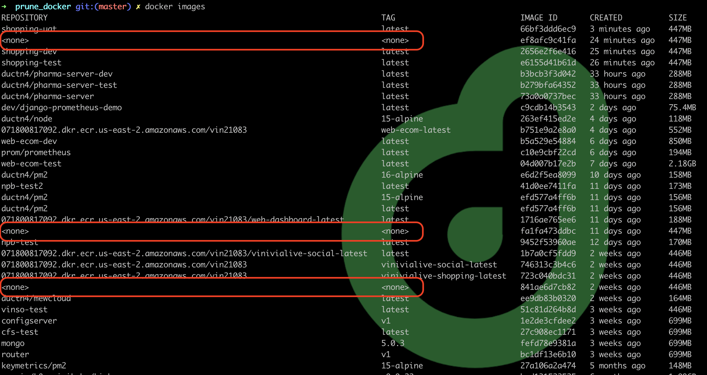
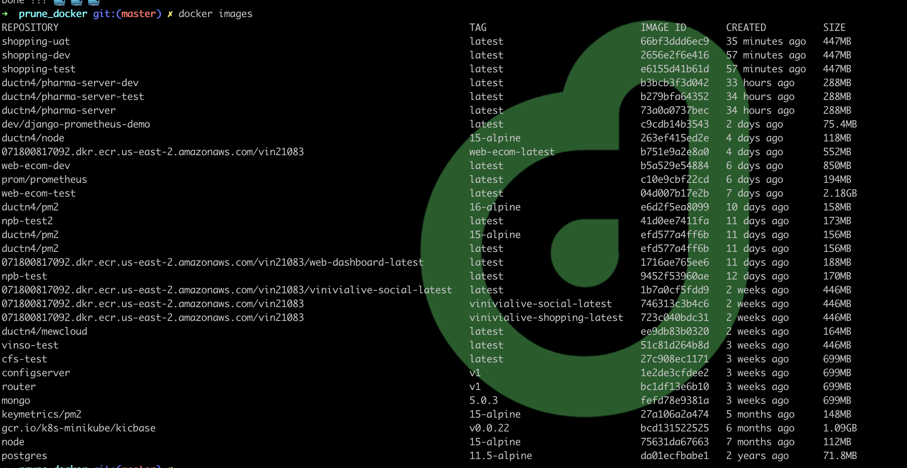

# Prune Docker

[](https://github.com/ductnn/prune_docker/pulls)
[](LICENSE)

A lazy tool for removing images and containers untagged in your machine written
in Python.

## Feature
- Remove `images` have tag `<none>`.
- Remove `containers` do not running. 



## Usage

Requirements:
  - `Python 3.5+`
  - `Docker version 20.10.7, build f0df350`: In my case.

Follow `command`:

```bash
git clone https://github.com/ductnn/prune_docker.git
cd prune_docker
python3 prune.py
```

The sample result:

- Before:
```bash
➜  prune_docker git:(master) ✗ docker images
REPOSITORY                                                                        TAG                           IMAGE ID       CREATED          SIZE
shopping-uat                                                                      latest                        66bf3ddd6ec9   3 minutes ago    447MB
<none>                                                                            <none>                        ef8afc9c41fa   24 minutes ago   447MB
shopping-dev                                                                      latest                        2656e2f6e416   25 minutes ago   447MB
shopping-test                                                                     latest                        e6155d41b61d   26 minutes ago   447MB
ductn4/pharma-server-dev                                                          latest                        b3bcb3f3d042   33 hours ago     288MB
ductn4/pharma-server-test                                                         latest                        b279bfa64352   33 hours ago     288MB
ductn4/pharma-server                                                              latest                        73a0a0737bec   33 hours ago     288MB
dev/django-prometheus-demo                                                        latest                        c9cdb14b3543   2 days ago       75.4MB
ductn4/node                                                                       15-alpine                     263ef415ed2e   4 days ago       118MB
071800817092.dkr.ecr.us-east-2.amazonaws.com/vin21083                             web-ecom-latest               b751e9a2e8a0   4 days ago       552MB
web-ecom-dev                                                                      latest                        b5a529e54884   6 days ago       850MB
prom/prometheus                                                                   latest                        c10e9cbf22cd   6 days ago       194MB
web-ecom-test                                                                     latest                        04d007b17e2b   7 days ago       2.18GB
ductn4/pm2                                                                        16-alpine                     e6d2f5ea8099   10 days ago      158MB
npb-test2                                                                         latest                        41d0ee7411fa   11 days ago      173MB
ductn4/pm2                                                                        15-alpine                     efd577a4ff6b   11 days ago      156MB
ductn4/pm2                                                                        latest                        efd577a4ff6b   11 days ago      156MB
071800817092.dkr.ecr.us-east-2.amazonaws.com/vin21083/web-dashboard-latest        latest                        1716ae765ee6   11 days ago      188MB
<none>                                                                            <none>                        fa1fa473ddbc   11 days ago      447MB
npb-test                                                                          latest                        9452f53960ae   12 days ago      170MB
071800817092.dkr.ecr.us-east-2.amazonaws.com/vin21083/vinivialive-social-latest   latest                        1b7a0cf5fdd9   2 weeks ago      446MB
071800817092.dkr.ecr.us-east-2.amazonaws.com/vin21083                             vinivialive-social-latest     746313c3b4c6   2 weeks ago      446MB
071800817092.dkr.ecr.us-east-2.amazonaws.com/vin21083                             vinivialive-shopping-latest   723c040bdc31   2 weeks ago      446MB
<none>                                                                            <none>                        841ae6d7cb82   2 weeks ago      446MB
```

- Run `script`:
```bash
➜  prune_docker git:(master) ✗ python3 prune.py
# Id of untagged images
['ef8afc9c41fa', 'fa1fa473ddbc', '841ae6d7cb82']
Removing untagged images...
b'Deleted: sha256:ef8afc9c41fa090f801a13610a9c2db38d58fcda49732ccce321dacf2c35f303\n'
b'Deleted: sha256:fa1fa473ddbcad9519b176fdc9f10002b6d4dac4252de705c5833e6610a63254\n'
b'Deleted: sha256:841ae6d7cb82057fdc2fc749465549ba6a9a3715ff454eb1f36a1a96152ebcf8\n'
Done !!! 🐳 🐳 🐳
```

- Check result:



So very ... clean 😅 😅 😅.

## Show your support
Give a ⭐ if you like this application ❤️

## License
The MIT License (MIT). Please see [LICENSE](LICENSE) for more information.
